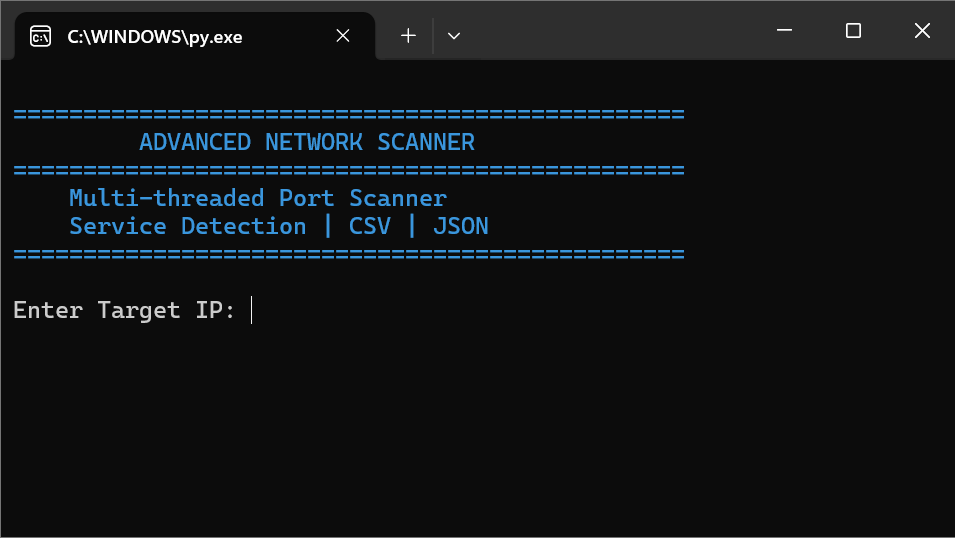
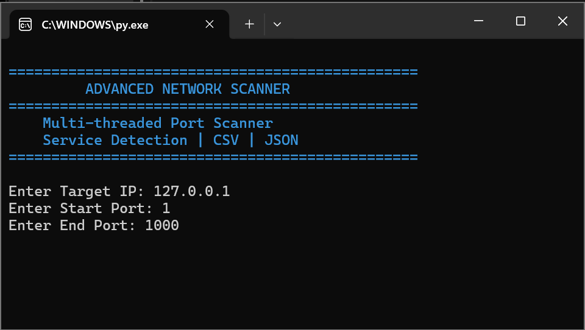
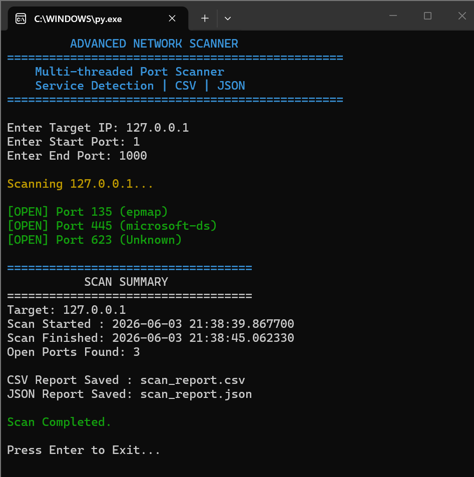

# Advanced Network Scanner

## Overview

Advanced Network Scanner is a Python-based cybersecurity tool designed to perform fast and efficient network reconnaissance. The scanner identifies open ports, detects common services running on those ports, and generates structured CSV and JSON reports for analysis.

The project demonstrates practical knowledge of socket programming, multi-threading, network security fundamentals, and automated reporting.

---

## Features

* Multi-threaded Port Scanning
* Open Port Discovery
* Service Detection
* Custom Port Range Selection
* CSV Report Generation
* JSON Report Generation
* Timestamp Logging
* Colored Console Output
* Fast Concurrent Scanning

---

## Technologies Used

* Python 3
* Socket Programming
* ThreadPoolExecutor
* CSV
* JSON
* Colorama

---

## Project Structure

```text
Advanced-Network-Scanner/
│
├── scanner.py
├── scan_report.csv
├── scan_report.json
├── README.md
│
└── screenshots/
    ├── scanner_home.png
    ├── scanning_process.png
    └── scan_result.png
```

---

## How It Works

1. User enters the target IP address.
2. User specifies the start and end port range.
3. The scanner performs concurrent port scanning using multi-threading.
4. Open ports are identified.
5. Common services are detected.
6. Results are exported to CSV and JSON reports.
7. A final scan summary is displayed.

---

## Workflow

```text
User Input
     ↓
Port Scanning
     ↓
Service Detection
     ↓
Report Generation
     ↓
Scan Summary
```

---

## Screenshots

### Home Screen



---

### Scanning Process



---

### Final Scan Summary



---

## Sample Output

```text
[OPEN] Port 135 (epmap)
[OPEN] Port 445 (microsoft-ds)
[OPEN] Port 623 (Unknown)

===================================
SCAN SUMMARY
===================================

Target: 127.0.0.1
Open Ports Found: 3

CSV Report Saved : scan_report.csv
JSON Report Saved: scan_report.json

Scan Completed.
```

---

## Example CSV Report

| Port | Service      |
| ---- | ------------ |
| 135  | epmap        |
| 445  | microsoft-ds |
| 623  | Unknown      |

---

## Applications

* Network Reconnaissance
* Security Assessment
* Service Enumeration
* Cybersecurity Learning
* Network Administration

---

## Learning Outcomes

* Socket Programming
* TCP/IP Networking
* Multi-threading
* Service Enumeration
* Report Automation
* Network Security Fundamentals

---

## Future Enhancements

* Host Discovery
* Subnet Scanning
* Banner Grabbing
* Vulnerability Detection
* GUI Version
* PDF Report Generation

---

## Author

Nishmanul Haq

Cybersecurity Enthusiast | Network Security | Python Developer


